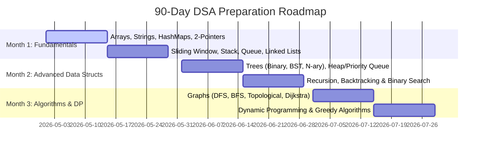

# 3-Month DSA Crack Sheet: Zero to MAANG/High-Level Interviews 🎯

High-level software engineering interviews (especially for Senior/Staff or AI Backend roles) expect you to solve **Medium to Hard** DSA problems and explain their time/space complexity optimally in **30-45 minutes**.

This guide is structured as a **90-Day (12-Week) Comprehensive DSA Mastery Plan**. Every week contains essential theory, core patterns, and handpicked **Easy, Medium, and Hard** questions with Python templates.

---

## 📅 The 3-Month Weekly Roadmap



---

## 🧱 Month 1: Linear Data Structures & Dynamic Patterns

### Week 1 & 2: Arrays, Strings, HashMaps & Two Pointers
* **Core Theory**: Contiguous memory layout, amortized $O(1)$ operations, sliding window concept, lookup time of HashMaps, and space-time trade-off.
* **Important Patterns**:
  * **Two Pointers**: Moving pointers from boundaries inward or two pointers moving at different speeds to solve constraints in $O(N)$ time instead of $O(N^2)$.
  * **Prefix Sum**: Precomputing array sums to answer range query problems in $O(1)$.

#### 📝 Curated Questions

| Level | Problem Name | Core Concept / Pattern |
|---|---|---|
| **Easy** | [Two Sum (LeetCode 1)](https://leetcode.com/problems/two-sum/) | HashMap lookup |
| **Easy** | [Valid Palindrome (LeetCode 125)](https://leetcode.com/problems/valid-palindrome/) | Two Pointers |
| **Medium** | [3Sum (LeetCode 15)](https://leetcode.com/problems/3sum/) | Sorting + Two Pointers |
| **Medium** | [Container With Most Water (LeetCode 11)](https://leetcode.com/problems/container-with-most-water/) | Greedy Two Pointers |
| **Hard** | [First Missing Positive (LeetCode 41)](https://leetcode.com/problems/first-missing-positive/) | Cyclic Sort / In-place hashing |

---

### Week 3: Sliding Window & Monotonic Stack/Queue
* **Core Theory**: 
  * **Sliding Window**: Ideal for subarray/substring problems where you need to maintain a continuous block of elements satisfying a specific condition.
  * **Monotonic Stack**: A stack that maintains elements in strict increasing or decreasing order. Essential for finding the *"next greater"* or *"next smaller"* element in $O(N)$ time.

#### 📝 Curated Questions

| Level | Problem Name | Core Concept / Pattern |
|---|---|---|
| **Easy** | [Best Time to Buy & Sell Stock (LeetCode 121)](https://leetcode.com/problems/best-time-to-buy-and-sell-stock/) | Single Pass / Min-So-Far |
| **Medium** | [Longest Substring Without Repeating Chars (LeetCode 3)](https://leetcode.com/problems/longest-substring-without-repeating-characters/) | Variable Size Sliding Window |
| **Medium** | [Daily Temperatures (LeetCode 739)](https://leetcode.com/problems/daily-temperatures/) | Monotonic Stack |
| **Hard** | [Sliding Window Maximum (LeetCode 239)](https://leetcode.com/problems/sliding-window-maximum/) | Monotonic Queue (Deque) |

---

### Week 4: Linked Lists (Fast & Slow Pointers, In-place Reversal)
* **Core Theory**: Non-contiguous memory allocation, pointers manipulations, handling edge cases (empty list, single node, cycles).
* **Templates**: Always use a **Dummy Node** to simplify boundary deletions and insertions.

#### 📝 Curated Questions

| Level | Problem Name | Core Concept / Pattern |
|---|---|---|
| **Easy** | [Reverse Linked List (LeetCode 206)](https://leetcode.com/problems/reverse-linked-list/) | Pointer manipulation |
| **Easy** | [Linked List Cycle (LeetCode 141)](https://leetcode.com/problems/linked-list-cycle/) | Floyd's Cycle (Fast & Slow) |
| **Medium** | [Remove Nth Node From End (LeetCode 19)](https://leetcode.com/problems/remove-nth-node-from-end-of-list/) | Two pointer gap |
| **Medium** | [Copy List with Random Pointer (LeetCode 138)](https://leetcode.com/problems/copy-list-with-random-pointer/) | Deep copy / Hash mapping |
| **Hard** | [Merge k Sorted Lists (LeetCode 23)](https://leetcode.com/problems/merge-k-sorted-lists/) | Min-Heap / Divide & Conquer |

---

## 🌳 Month 2: Hierarchical structures & Search Optimization

### Week 5 & 6: Trees (DFS, BFS, BST, Trie)
* **Core Theory**: Recursive structures. Depth First Search (Pre-order, In-order, Post-order) and Breadth First Search (Level-order). Binary Search Trees (BST) property: `Left < Parent < Right`.
* **Trie (Prefix Tree)**: Essential for searching strings with prefixes.

#### 📝 Curated Questions

| Level | Problem Name | Core Concept / Pattern |
|---|---|---|
| **Easy** | [Invert Binary Tree (LeetCode 226)](https://leetcode.com/problems/invert-binary-tree/) | Post-order traversal |
| **Medium** | [Binary Tree Level Order Traversal (LeetCode 102)](https://leetcode.com/problems/binary-tree-level-order-traversal/) | BFS / Queue implementation |
| **Medium** | [Validate BST (LeetCode 98)](https://leetcode.com/problems/validate-binary-search-tree/) | DFS with range boundaries |
| **Medium** | [Implement Trie (LeetCode 208)](https://leetcode.com/problems/implement-trie-prefix-tree/) | Dictionary-based nodes |
| **Hard** | [Binary Tree Maximum Path Sum (LeetCode 124)](https://leetcode.com/problems/binary-tree-maximum-path-sum/) | Recursive bottom-up bubble |

---

### Week 7: Heaps & Priority Queues
* **Core Theory**: Min-Heap & Max-Heap. Great for tracking top $K$ elements. Insertion & deletion take $O(\log N)$, reading min/max takes $O(1)$.

#### 📝 Curated Questions

| Level | Problem Name | Core Concept / Pattern |
|---|---|---|
| **Easy** | [Last Stone Weight (LeetCode 1046)](https://leetcode.com/problems/last-stone-weight/) | Basic Max-Heap |
| **Medium** | [Top K Frequent Elements (LeetCode 347)](https://leetcode.com/problems/top-k-frequent-elements/) | Min-Heap of size K |
| **Medium** | [Find K Closest Points to Origin (LeetCode 973)](https://leetcode.com/problems/k-closest-points-to-origin/) | Min-Heap |
| **Hard** | [Find Median from Data Stream (LeetCode 295)](https://leetcode.com/problems/find-median-from-data-stream/) | Dual Heaps (Min-Heap + Max-Heap) |

---

### Week 8: Recursion, Backtracking & Advanced Binary Search
* **Core Theory**: 
  * **Backtracking**: Finding all possible combinations/permutations and pruning invalid branches early.
  * **Binary Search on Answer**: When the answer space is monotonic, you binary search the actual answer instead of elements of the array.

#### 📝 Curated Questions

| Level | Problem Name | Core Concept / Pattern |
|---|---|---|
| **Easy** | [Binary Search (LeetCode 704)](https://leetcode.com/problems/binary-search/) | Left/Right pointers template |
| **Medium** | [Search in Rotated Sorted Array (LeetCode 33)](https://leetcode.com/problems/search-in-rotated-sorted-array/) | Pivot-based Binary Search |
| **Medium** | [Permutations (LeetCode 46)](https://leetcode.com/problems/permutations/) | Backtracking / State swapping |
| **Medium** | [Koko Eating Bananas (LeetCode 875)](https://leetcode.com/problems/koko-eating-bananas/) | Binary Search on Answer |
| **Hard** | [N-Queens (LeetCode 51)](https://leetcode.com/problems/n-queens/) | Backtracking with constraint sets |

---

## 🕸️ Month 3: Graphs & Dynamic Programming (The MAANG Bar)

### Week 9 & 10: Graph Algorithms (BFS, DFS, Topological, Shortest Path)
* **Core Theory**: 
  * Representing graphs: Adjacency List is highly preferred.
  * **Topological Sort (Kahn’s Algorithm)**: Essential for dependency resolving problems.
  * **Dijkstra's Algorithm**: Finding the shortest path in weighted graphs using a Priority Queue.

#### 📝 Curated Questions

| Level | Problem Name | Core Concept / Pattern |
|---|---|---|
| **Easy** | [Flood Fill (LeetCode 733)](https://leetcode.com/problems/flood-fill/) | DFS / BFS matrix flood |
| **Medium** | [Number of Islands (LeetCode 200)](https://leetcode.com/problems/number-of-islands/) | Matrix BFS/DFS traversal |
| **Medium** | [Course Schedule (LeetCode 207)](https://leetcode.com/problems/course-schedule/) | Topological Sort / Cycle detection |
| **Medium** | [Network Delay Time (LeetCode 743)](https://leetcode.com/problems/network-delay-time/) | Dijkstra's Algorithm |
| **Hard** | [Alien Dictionary (LeetCode 269 - Premium)](https://leetcode.com/problems/alien-dictionary/) | Topological sort on characters |

---

### Week 11 & 12: Dynamic Programming (DP) & Greedy Algorithms
* **Core Theory**: Breaking down a problem into overlapping subproblems. 
  * **Memoization (Top-down)**: Recursion + Cache.
  * **Tabulation (Bottom-up)**: Solving subproblems iteratively starting from the base case.
  * **Key Types**: 1D DP, 0/1 Knapsack, Longest Common Subsequence (LCS).

#### 📝 Curated Questions

| Level | Problem Name | Core Concept / Pattern |
|---|---|---|
| **Easy** | [Climbing Stairs (LeetCode 70)](https://leetcode.com/problems/climbing-stairs/) | 1D DP / Fibonacci |
| **Medium** | [Coin Change (LeetCode 322)](https://leetcode.com/problems/coin-change/) | Unbounded Knapsack / Min Coins |
| **Medium** | [Longest Increasing Subsequence (LeetCode 300)](https://leetcode.com/problems/longest-increasing-subsequence/) | DP with Binary Search optimization |
| **Medium** | [House Robber (LeetCode 198)](https://leetcode.com/problems/house-robber/) | DP with alternating states |
| **Hard** | [Edit Distance (LeetCode 72)](https://leetcode.com/problems/edit-distance/) | 2D Grid DP |

---

## 🛠️ The Ultimate Python Interview Templates

Use these standardized templates during interviews to avoid syntax slips.

### 1. BFS on Binary Tree / Graph Matrix
```python
from collections import deque

def bfs_template(root):
    if not root:
        return []
    
    queue = deque([root])
    result = []
    
    while queue:
        level_size = len(queue)
        current_level = []
        
        for _ in range(level_size):
            node = queue.popleft()
            current_level.append(node.val)
            
            # Add child nodes
            if node.left:
                queue.append(node.left)
            if node.right:
                queue.append(node.right)
                
        result.append(current_level)
    return result
```

### 2. Binary Search Template (Avoids Infinite Loops)
```python
def binary_search(nums, target):
    left, right = 0, len(nums) - 1
    
    while left <= right:
        mid = left + (right - left) // 2  # Prevents overflow
        
        if nums[mid] == target:
            return mid
        elif nums[mid] < target:
            left = mid + 1
        else:
            right = mid - 1
            
    return -1
```

### 3. Backtracking Skeleton
```python
def backtrack_template(choices, path, result):
    # Base Case / Goal met
    if is_solution(path):
        result.append(list(path))
        return
        
    for choice in choices:
        if is_valid(choice):
            # Take decision
            path.append(choice)
            
            # Recurse
            backtrack_template(choices, path, result)
            
            # Revert decision (Backtrack)
            path.pop()
```

---

## 💡 How to Practice Daily to Crack Interviews

1. **Don't Memorize Solutions**: Focus on the **Pattern** (e.g., if a problem asks for contiguous subarrays, immediately think of *Sliding Window*).
2. **Timebox Yourself**: Give yourself **20 minutes** for Easy, **35 minutes** for Medium, and **50 minutes** for Hard. If you get stuck, look at the discussion section, understand the approach, write the code yourself, and review it again after 3 days.
3. **Write Space/Time Complexity**: Always explicitly state the time complexity ($O(N)$, $O(N\log N)$, etc.) and auxiliary space complexity before writing the code in an interview.
