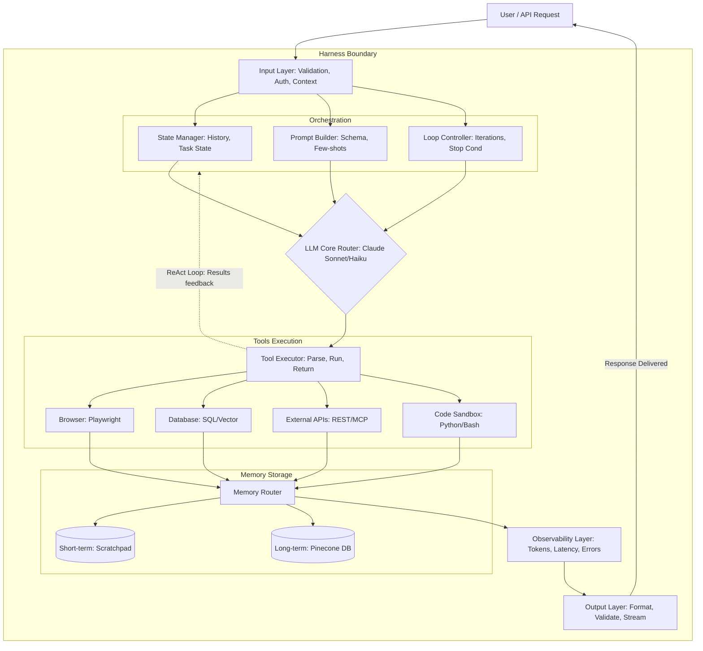

# 🤖 LLM Agent Harness Architecture Explained

Aapne jo diagram share kiya hai, wo ek **Production-Grade AI Agent** ka architecture hai. Ise **"Agent Harness"** (ya Orchestration Layer) kehte hain. 

Akela LLM (jaise GPT-4 ya Claude) sirf text generate kar sakta hai, uska bahari duniya se koi connection nahi hota. Ye "Harness" us LLM ke charo taraf ek wrapper (system) banata hai jisse wo internet browse kar sake, code run kar sake, purani baatein yaad rakh sake, aur safe tarike se operate kare.

Chaliye is graph ke har block ko step-by-step detail mein samajhte hain:

---

## System Architecture Diagram (Mermaid)

---

## 1. Input Layer (Entry Point)
Jab bhi User ya koi API request karta hai, wo sabse pehle Input Layer pe aati hai. 
Iska main kaam security aur validation hai:
- **Validation:** Kya input ka format sahi hai?
- **Rate Limiting:** Kya user ne limit se zyada API calls toh nahi kiye? (To prevent DDoS & high billing).
- **Auth:** Kya user authorized hai ye request karne ke liye?
- **Context Injection:** User ke base context ko request ke sath attach karna.

---

## 2. Orchestration Layer (The Brain Setup)
Ye layer prompt ko prepare karti hai aur LLM ko control karti hai. Isme 3 blocks hain:
- **State Manager:** Current baat-cheet kahan tak pahunchi hai? Ye user ki conversation history aur task ke current variables ko manage karta hai.
- **Prompt Builder:** Ye LLM ke paas jaane wala final lamba text banata hai. Isme System Prompt, **Tool Schema** (taaki LLM ko pata rahe uske paas kya-kya tools hain), aur Few-Shots (kuch examples) add kiye jate hain.
- **Loop Controller:** AI Agents **ReAct (Reason + Act) loop** mein chalte hain (bar-bar sochte hain aur action lete hain). Loop controller is baat ka dhyan rakhta hai ki Agent kisi infinite loop mein na fas jaye. Isme Max Iterations aur Timeouts set kiye jate hain.

---

## 3. LLM Core — Model Router (The Brain)
Ye wo jagah hai jahan actually LLM API call hoti hai. Ek production system hamesha ek LLM pe dependent nahi rehta.
- **Router:** Ye request ki complexity ke hisaab se decide karta hai ki request kis model ko bhejni hai. Agar coding/complex reasoning hai toh **Claude Sonnet / GPT-4** (mehnga model) ko bhejega. Agar simple text parsing hai toh **Claude Haiku / GPT-3.5** (sasta aur fast model) ko bhejega.
- **Fallback Logic:** Agar Anthropic ka server down hai, toh automatically OpenAI pe shift ho jayega.

---

## 4. Tool Executor (The Hands & Legs)
LLM khud code run ya web search nahi karta. Wo sirf JSON mein output deta hai ki *"Mujhe ye tool chalana hai in parameters ke sath"*.
Tool Executor us JSON ko parse karta hai, validate karta hai, aur actual mein tool chalata hai. Agar koi error aaye (jaise syntax error), toh wo error LLM ko wapas bhejta hai ki *"Tumne galat tool use kiya, fix karo"*.

**Available Tools:**
- **Browser:** Playwright / Selenium ka use karke websites open karna aur scraping karna.
- **Database:** SQL queries run karna ya RAG ke liye Vector search karna.
- **External APIs:** REST, GraphQL, ya **MCP (Model Context Protocol)** ke through dusre softwares se baat karna.
- **Code Executor:** Agent ne jo code likha hai use safely run karne ke liye ek **Bash/Python Sandbox** (taaki main server hack na ho jaye).

---

## 5. Memory Layer (The Retention)
Agent ko baatein yaad rakhne ke liye do tarah ki memory chahiye:
- **Short-term Memory:** Ye current task ka **Scratchpad** hota hai (In-context window). Jab task khatam ho jata hai, toh ye memory flush (delete) ho jati hai.
- **Long-term Memory:** Pichle sessions ki baatein aur User Preferences. Ye data lambe samay tak **Pinecone (Vector DB)** aur **PostgreSQL** mein store hota hai taaki Agent ko pichli baatein yaad rahein.

---

## 6. Observability Layer (The Monitor)
Production mein system kaisa chal raha hai, ye dekhna zaroori hai. Ye layer AI Operations (LLMOps) ka part hai.
- Ye check karta hai ki **Token usage** kitna hua (Billing), response mein kitna time laga (Latency), aur **Error rate** kya hai.
- Isme LangSmith ya DataDog jaise tools use hote hain jo har ek step ko trace karte hain. Agar Agent lagatar fail ho raha hai, toh developers ko Alerts bhejte hain.

---

## 7. Output Layer (Final Delivery)
Agent ne jo final kaam complete kar liya, usko user tak deliver karna.
- **Format & Post-Process:** Output ko sahi markdown/JSON format mein convert karna.
- **Validate:** Kya output mein koi gaali ya sensitive info (PII) toh nahi hai?
- **Stream:** User ko word-by-word (Streaming) ke form mein output bhejna (jaise ChatGPT mein UI pe type hota hua dikhta hai).

---

### Conclusion (Interview ke liye)
Agar aap interviewer ko ye graph samjha rahe hain, toh simply kahein: 
*"Sir, LLM sirf text prediction engine hai. Ek autonomous Agent banane ke liye humein 'Harness Layer' lagani padti hai, jo LLM ko Tools (like Code Sandbox), Memory (Vector DB), aur ek Loop Controller (ReAct logic) provide karti hai, with strict Observability for tracing tokens."*
