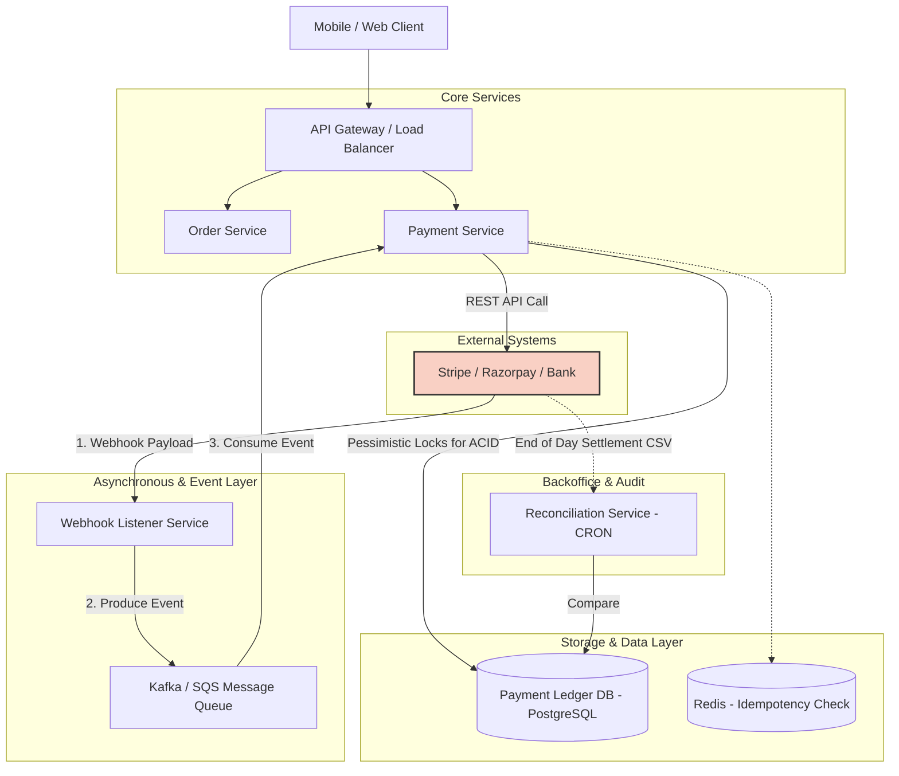
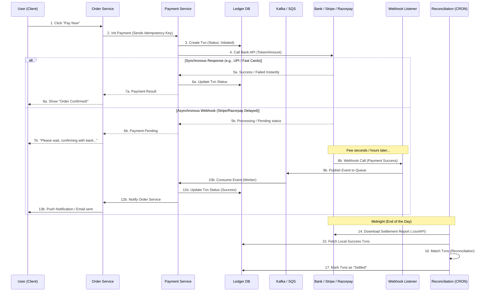
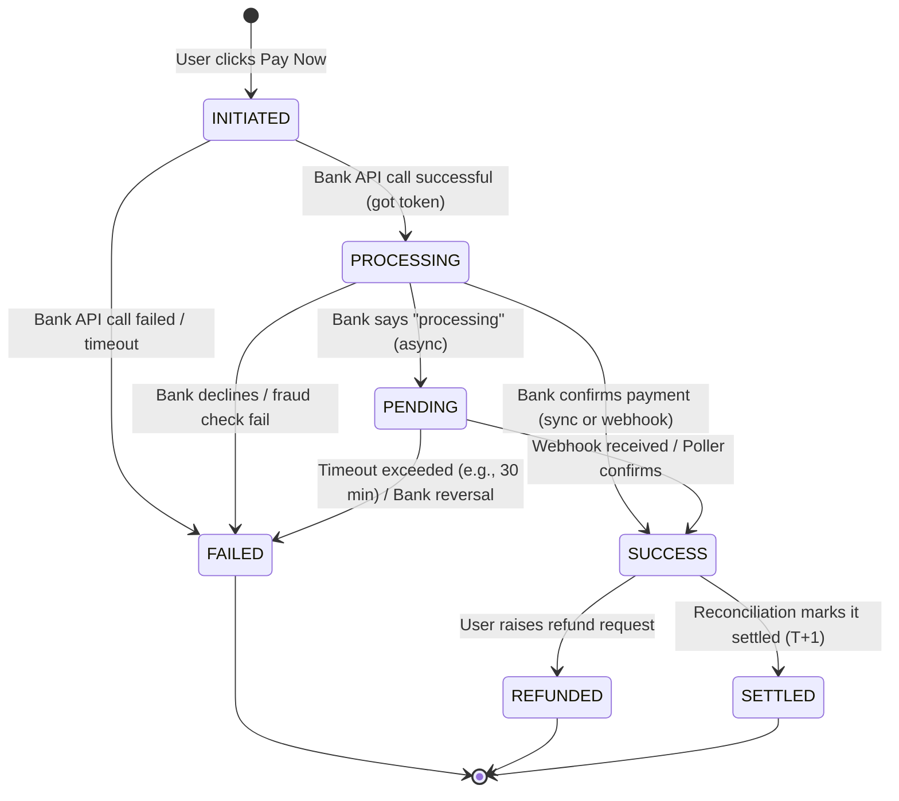
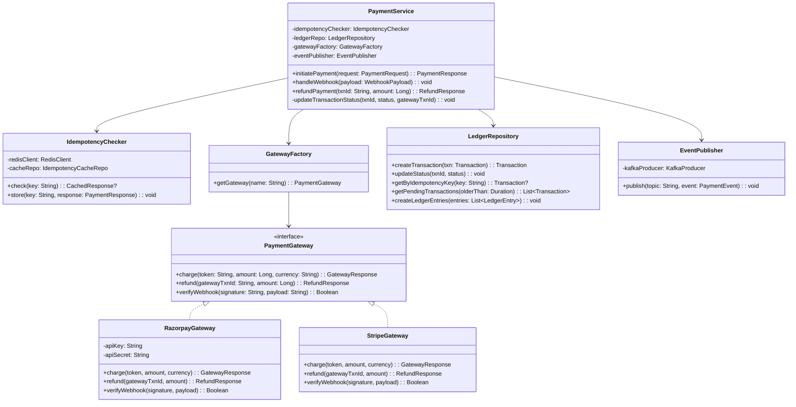
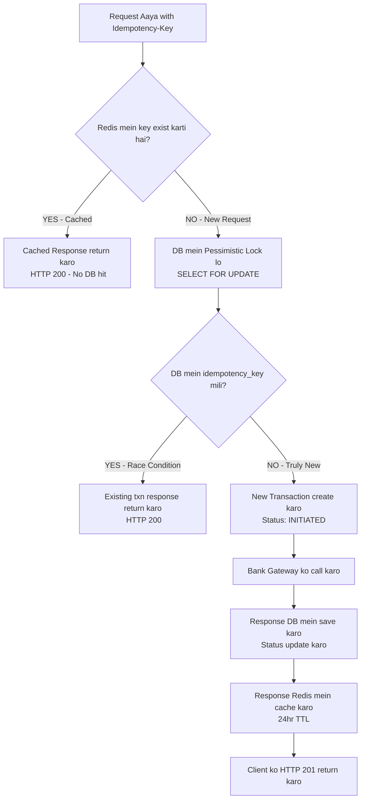

# 🏗️ Fintech System Design: HLD & Data Flow Diagram (DFD)

Jab aap kisi interview mein Fintech ya Payment Gateway ka system design karte hain, toh white-boarding (diagrams) sabse important hoti hai. Yahan humne **High-Level Design (HLD)** aur **Data Flow Diagram (Sequence)** banaya hai jo Stripe, Razorpay ya kisi bhi standard payment system ko represent karta hai.

---

## 1. High-Level Design (HLD) Architecture

Ye diagram dikhata hai ki system ke alag-alag components (Services, Databases, Queues) aapas mein kaise connect hote hain.



### HLD Components Explanation:
1. **API Gateway:** Saari incoming traffic ko handle karta hai, rate limiting aur authentication karta hai.
2. **Payment Service:** Ye main brain hai. Ye Idempotency check karta hai (Redis se), aur Transaction banata hai (PostgreSQL mein).
3. **Redis:** Ye check karne ke liye use hota hai ki same `Idempotency-Key` se do baar payment na ho (Race condition / Double spend rukna).
4. **PostgreSQL Ledger:** Relational database jisme strictly ACID transactions aur double-entry accounting hoti hai.
5. **Webhook Listener + Kafka:** Bank ka response kabhi bhi aa sakta hai, isliye Webhooks ko directly process na karke Kafka queue mein dala jata hai taaki heavy load pe system crash na ho.
6. **Reconciliation Service:** Ye service raat mein chalti hai, aur bank ki T+1 settlement file ko apne DB ki entries se match karti hai.

---

## 2. Data Flow Diagram / Sequence Flow (DFD)

Ye diagram dikhata hai ki ek Payment request starting (User click) se lekar End (Settlement) tak kaise travel karti hai. Isme Synchronous aur Asynchronous dono flows hain.



### Interview Tips for Flow:
- Interviewer poochega: *"Agar Webhook Listener fail ho gaya toh?"*
  - **Aapka Answer:** "Humne Kafka (Message Queue) lagaya hai. Agar Listener webhook le leta hai, toh wo queue mein save ho jata hai. Agar aage ka Payment Service down bhi ho, toh event Kafka mein safe rahega aur jab service up aayegi toh process ho jayega."
- Interviewer poochega: *"Agar Stripe ne Webhook bheja hi nahi toh?"*
  - **Aapka Answer:** "Hum ek background CRON job (Poller) lagayenge jo har 10 minute mein un transactions ko Stripe API se verify karega jo 'Pending' status mein atke hue hain."

---

## 3. Low Level Design (LLD)

LLD mein hum andar jaate hain — Database schema, API contracts, class design, aur critical algorithms.

---

### 3.1 Payment Transaction State Machine

Ek payment ka lifecycle ek **State Machine** follow karta hai. Ye interviewer ka favourite topic hai.



**Rule:** Status sirf forward direction mein ja sakta hai (INITIATED → PROCESSING → SUCCESS). Kabhi bhi `SUCCESS` se `INITIATED` nahi hoga. Ye constraint DB level pe enforce karein.

---

### 3.2 Database Schema Design

#### `transactions` Table (Core Ledger)

```sql
CREATE TABLE transactions (
    id              UUID            PRIMARY KEY DEFAULT gen_random_uuid(),
    idempotency_key VARCHAR(255)    NOT NULL UNIQUE,  -- Duplicate payment rokne ke liye
    order_id        UUID            NOT NULL,
    user_id         UUID            NOT NULL,
    amount          BIGINT          NOT NULL,          -- Paise mein store karo (e.g., 10050 = ₹100.50)
    currency        CHAR(3)         NOT NULL DEFAULT 'INR',
    status          VARCHAR(20)     NOT NULL DEFAULT 'INITIATED',
    -- CHECK constraint: sirf valid states allow karo
    CONSTRAINT valid_status CHECK (status IN ('INITIATED','PROCESSING','PENDING','SUCCESS','FAILED','REFUNDED','SETTLED')),
    gateway         VARCHAR(50),                       -- 'STRIPE', 'RAZORPAY', 'PAYU'
    gateway_txn_id  VARCHAR(255),                      -- Bank ka reference ID
    failure_reason  TEXT,
    metadata        JSONB,                             -- Extra data (UPI ID, card last 4, etc.)
    created_at      TIMESTAMPTZ     NOT NULL DEFAULT NOW(),
    updated_at      TIMESTAMPTZ     NOT NULL DEFAULT NOW()
);

-- Indexes (Performance ke liye critical)
CREATE INDEX idx_txn_user_id       ON transactions(user_id);
CREATE INDEX idx_txn_order_id      ON transactions(order_id);
CREATE INDEX idx_txn_status        ON transactions(status);  -- Poller ke liye (PENDING txns fetch)
CREATE INDEX idx_txn_gateway_txn   ON transactions(gateway_txn_id);
CREATE UNIQUE INDEX idx_txn_idem   ON transactions(idempotency_key);
```

> **Interview Tip:** Amount ko `DECIMAL(10,2)` ki jagah `BIGINT` (paise/cents) mein store karo. Floating point arithmetic mein ₹0.001 ka error aa sakta hai — fintech mein ye catastrophic hota hai.

---

#### `ledger_entries` Table (Double-Entry Accounting)

Har ek transaction ke liye **2 entries** hoti hain — Debit aur Credit. Ye accounting ka golden rule hai.

```sql
CREATE TABLE ledger_entries (
    id              UUID        PRIMARY KEY DEFAULT gen_random_uuid(),
    transaction_id  UUID        NOT NULL REFERENCES transactions(id),
    account_id      UUID        NOT NULL,   -- Kaun sa account (User, Platform, Gateway)
    entry_type      CHAR(2)     NOT NULL,   -- 'DR' (Debit) ya 'CR' (Credit)
    amount          BIGINT      NOT NULL,
    balance_after   BIGINT      NOT NULL,   -- Entry ke baad account balance
    created_at      TIMESTAMPTZ NOT NULL DEFAULT NOW()
);

-- Example: User ₹100 pay karta hai
-- Entry 1: User Account DR ₹100  (user ka paisa gaya)
-- Entry 2: Platform Account CR ₹100  (platform ko mila)
-- Total DR = Total CR → Balance sheet hamesha zero sum hogi
```

---

#### `idempotency_cache` Table (Redis alternative if needed)

```sql
CREATE TABLE idempotency_cache (
    idempotency_key VARCHAR(255) PRIMARY KEY,
    response_body   JSONB        NOT NULL,   -- Pehli request ka response store
    created_at      TIMESTAMPTZ  NOT NULL DEFAULT NOW(),
    expires_at      TIMESTAMPTZ  NOT NULL    -- 24 ghante baad expire
);
```

---

### 3.3 API Contract Design (REST)

#### POST `/v1/payments` — Payment Initiate Karo

```
Request Headers:
  Authorization: Bearer <JWT_TOKEN>
  Idempotency-Key: <UUID>          ← Client generate karta hai, REQUIRED
  Content-Type: application/json

Request Body:
{
  "order_id": "ord_abc123",
  "amount": 10050,                  ← Always in paise/cents
  "currency": "INR",
  "payment_method": {
    "type": "card",
    "token": "tok_visa_4242"        ← Tokenized by frontend SDK (PCI compliance)
  }
}

Response 201 (Created - New Payment):
{
  "transaction_id": "txn_xyz789",
  "status": "PROCESSING",
  "created_at": "2026-06-13T10:30:00Z"
}

Response 200 (OK - Duplicate, Idempotency hit):
{
  "transaction_id": "txn_xyz789",   ← Same response as original
  "status": "SUCCESS",
  "message": "Duplicate request, returning cached response"
}

Response 409 (Conflict):
{
  "error": "DUPLICATE_PAYMENT",
  "message": "Payment already exists for this order"
}
```

---

#### GET `/v1/payments/{transaction_id}` — Status Check

```
Response 200:
{
  "transaction_id": "txn_xyz789",
  "order_id": "ord_abc123",
  "amount": 10050,
  "currency": "INR",
  "status": "SUCCESS",
  "gateway": "RAZORPAY",
  "gateway_txn_id": "pay_RAZORPAY123",
  "settled_at": "2026-06-14T00:00:00Z"
}
```

---

#### POST `/v1/payments/{transaction_id}/refund` — Refund

```
Request Body:
{
  "amount": 10050,      ← Partial refund bhi ho sakta hai
  "reason": "CUSTOMER_REQUEST"
}

Response 202 (Accepted - Async process):
{
  "refund_id": "ref_abc999",
  "status": "INITIATED",
  "message": "Refund will be processed in 5-7 business days"
}
```

---

### 3.4 Class / Service Design



---

### 3.5 Idempotency Logic — Step by Step

Ye sabse important algorithm hai fintech mein. Double payment rokna.



**Code Snippet (Pseudocode):**

```typescript
async initiatePayment(req: PaymentRequest): Promise<PaymentResponse> {
  const key = req.idempotencyKey;

  // Step 1: Redis check (fast path)
  const cached = await redis.get(`idem:${key}`);
  if (cached) return JSON.parse(cached); // 200 OK

  // Step 2: DB-level lock (slow path, race condition safe)
  return await db.transaction(async (trx) => {
    const existing = await trx('transactions')
      .where({ idempotency_key: key })
      .forUpdate()  // Pessimistic Lock — dusra request wait karega
      .first();

    if (existing) return toResponse(existing); // Already exists

    // Step 3: Create new transaction
    const txn = await trx('transactions').insert({
      idempotency_key: key,
      order_id: req.orderId,
      amount: req.amount,
      status: 'INITIATED',
    }).returning('*');

    // Step 4: Call Gateway
    const gateway = gatewayFactory.getGateway(req.gateway);
    const result = await gateway.charge(req.token, req.amount, req.currency);

    // Step 5: Update status
    await trx('transactions')
      .where({ id: txn.id })
      .update({ status: result.success ? 'PROCESSING' : 'FAILED',
                gateway_txn_id: result.gatewayTxnId });

    const response = toResponse(txn);

    // Step 6: Cache in Redis
    await redis.setex(`idem:${key}`, 86400, JSON.stringify(response)); // 24hr TTL

    return response; // 201 Created
  });
}
```

---

### 3.6 Webhook Verification (Security Critical)

Bank se aane wala webhook validate karna zaruri hai — warna koi bhi fake webhook bhej ke payment success mark kara sakta hai.

```typescript
async handleWebhook(headers: Headers, rawBody: string): Promise<void> {
  const gateway = gatewayFactory.getGateway(headers['x-gateway-name']);

  // Step 1: HMAC Signature Verify karo
  const signature = headers['x-razorpay-signature'];
  const isValid = gateway.verifyWebhook(signature, rawBody);
  if (!isValid) throw new UnauthorizedException('Invalid webhook signature');

  const payload = JSON.parse(rawBody);
  const event = payload.event; // e.g., "payment.captured"

  // Step 2: Idempotency check (same webhook dobara na process ho)
  const webhookId = headers['x-webhook-id'];
  const alreadyProcessed = await redis.get(`webhook:${webhookId}`);
  if (alreadyProcessed) return; // Silently ignore duplicate

  // Step 3: Kafka mein publish karo (fire and forget)
  await eventPublisher.publish('payment-events', {
    type: event,
    gatewayTxnId: payload.payment.id,
    status: payload.payment.status,
  });

  // Step 4: Mark webhook as processed
  await redis.setex(`webhook:${webhookId}`, 86400, '1');
}
```

---

### 3.7 Interview Mein LLD Questions & Answers

| Interviewer ka Question | Strong Answer |
|---|---|
| **Amount float mein kyun nahi?** | Floating point precision loss hota hai. ₹100.10 ko `float` mein store karo toh `100.09999...` ban sakta hai. `BIGINT` paise mein store karo (10010), display ke time divide karo. |
| **Idempotency key kaun generate karta hai?** | Client (frontend/mobile) generate karta hai, UUID v4. Server sirf check karta hai. Isse retry-safe requests banti hain. |
| **Double-entry accounting kyun?** | Agar sirf transaction table ho toh fraud ya bug se paisa "create" ya "destroy" ho sakta hai. Double-entry mein Total DR = Total CR hamesha. Inconsistency immediately detect hoti hai. |
| **Pessimistic vs Optimistic lock kab use karein?** | Fintech mein **Pessimistic** (`SELECT FOR UPDATE`) — kyunki conflict probability high hai, aur retry cost (duplicate payment) bahut zyada hai. |
| **Refund flow ka state machine?** | `REFUND_INITIATED` → `REFUND_PROCESSING` → `REFUND_SUCCESS` / `REFUND_FAILED`. Original txn `REFUNDED` mark hoti hai only after refund succeeds. |
