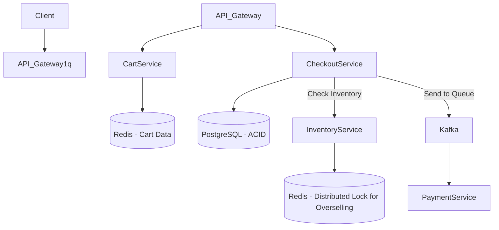
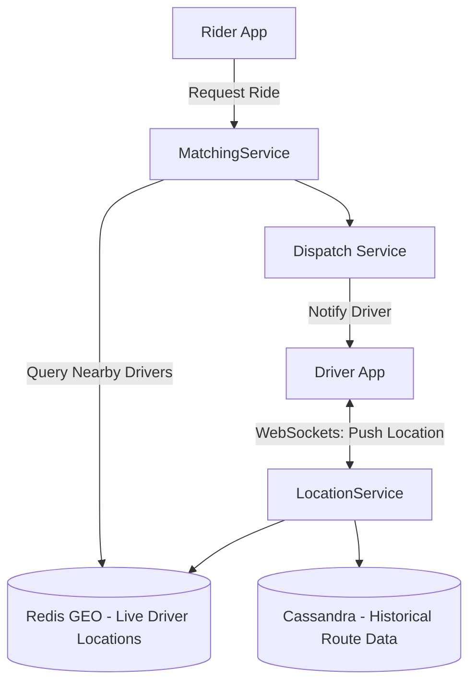
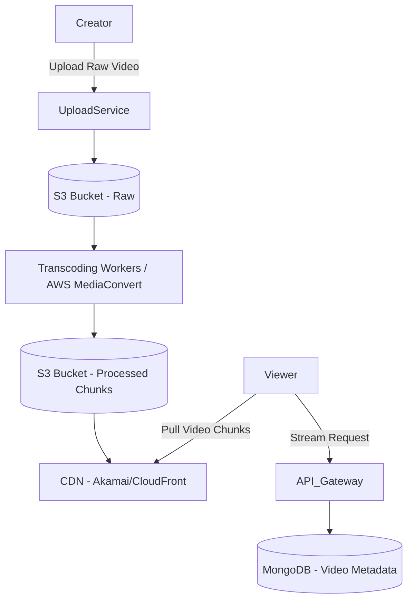
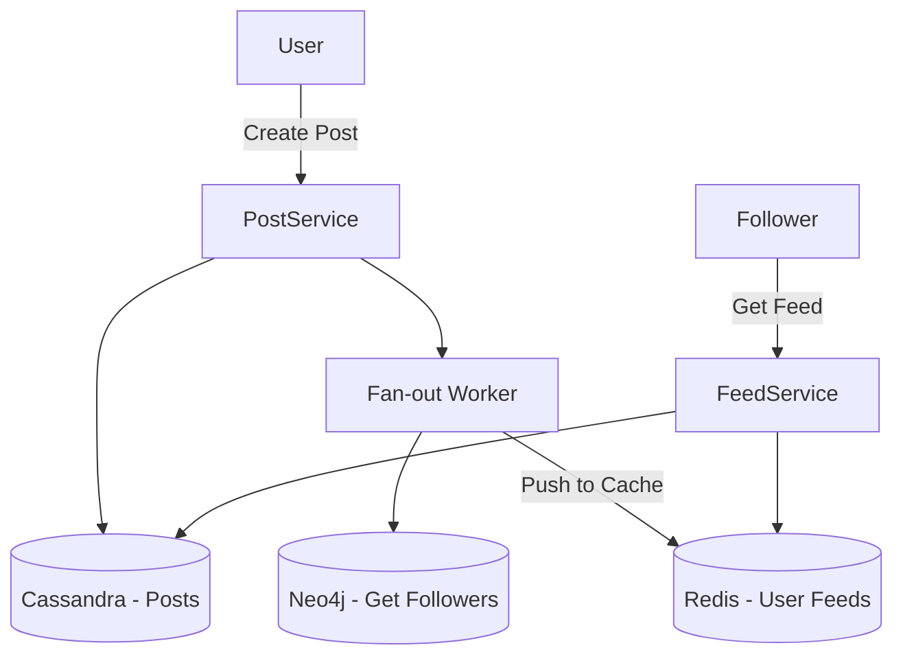

# 🚀 Top 4 High-Demand Domains: System Design Knowledge & HLD

Aaj kal interviews mein sirf generic design nahi puchte, wo check karte hain ki aapko **"Domain Specific Challenges"** pata hain ya nahi. Market mein currently in 4 domains ki sabse zyada demand hai. 

Yahan har domain ki "Core Problem", uski "Domain Knowledge" aur ek concise **HLD** diya gaya hai.

---

## 1. E-Commerce / Retail Domain (e.g., Amazon, Flipkart)

**Core Domain Problem:** Flash Sales (Big Billion Days). Jab lakho users ek sath "Buy" pe click karein toh inventory negative (overselling) nahi honi chahiye.
**Key Domain Concepts:**
- **Inventory Locking:** Jab item cart mein aaye toh 10 mins ke liye lock kar do (Redis mein TTL ke sath).
- **Cart & Checkout Separation:** Cart NoSQL (DynamoDB/Cassandra) mein hota hai kyunki wahan read/write bohot frequent hote hain, par Checkout aur Payment RDBMS (PostgreSQL) mein hote hain for ACID.

### Concise HLD (E-Commerce Flash Sale)

---

## 2. Ride-Sharing & Logistics Domain (e.g., Uber, Zomato, Swiggy)

**Core Domain Problem:** Real-time Location Tracking aur Rider-Driver Matching.
**Key Domain Concepts:**
- **Geospatial Indexing:** Hum normal lat/long ko DB mein store karke query nahi kar sakte. Hum **Geohash** ya **QuadTrees** (via Redis GEO ya PostgreSQL PostGIS) use karte hain taki pass ke (nearby) drivers jaldi search ho sakein.
- **Persistent Connections:** Drivers aur Riders ka live location track karne ke liye HTTP requests nahi chalengi. Yahan **WebSockets** ya **Server-Sent Events (SSE)** chahiye.

### Concise HLD (Ride-Sharing Matching)

---

## 3. Streaming & Media Domain (e.g., Netflix, YouTube, Hotstar)

**Core Domain Problem:** Heavy Video Files ko million devices par bina buffering stream karna, alag-alag internet speed ke sath.
**Key Domain Concepts:**
- **Video Transcoding / Encoding:** Upload hone par video ko alag-alag resolutions (1080p, 720p, 480p) aur formats mein convert kiya jata hai. Ise chunking kehte hain (DASH / HLS protocol).
- **CDN (Content Delivery Network):** Videos main server se serve nahi hote. Wo user ke nazdeek physical servers (CDN edge nodes like AWS CloudFront, Akamai) par cache hote hain taki latency zero ho.
- **Adaptive Bitrate Streaming:** Player internet speed check karke khud resolution switch karta hai.

### Concise HLD (Video Streaming)

---

## 4. Social Media / Messaging Domain (e.g., Instagram, WhatsApp, X)

**Core Domain Problem:** Lakho dosto ki posts ko ek second mein News Feed mein dikhana (Fanout Problem) aur real-time chat.
**Key Domain Concepts:**
- **Fan-out on Write (Push Model):** Agar ek normal user (100 followers) post dalta hai, toh system turant un 100 followers ke Redis cache feed list mein wo post push kar deta hai.
- **Fan-out on Read (Pull Model):** Agar Virat Kohli (100M followers) post dalta hai, toh 100M logo ke cache mein push karna system ko crash kar dega. Isliye wahan "Pull" model lagta hai (jab user app kholda hai tab post pull hoti hai).
- **Graph Databases:** "Mutual friends" ya "People you may know" ke liye Neo4j jaisa graph database use hota hai.

### Concise HLD (News Feed Generation)

---

## 💡 Interview Pro-Tip
Agar interviewer aapko koi problem de, toh pehle domain identify karein:
- Agar **System B2B/Fintech** hai -> Focus on ACID, Consistency, Kafka, SAGA.
- Agar **System B2C/Social/E-commerce** hai -> Focus on Cache (Redis), NoSQL (Cassandra), CDNs, aur Eventual Consistency.
