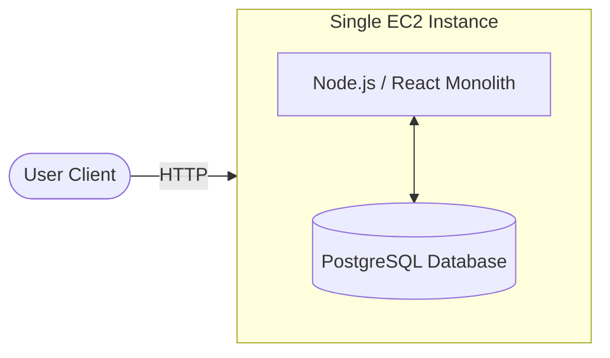
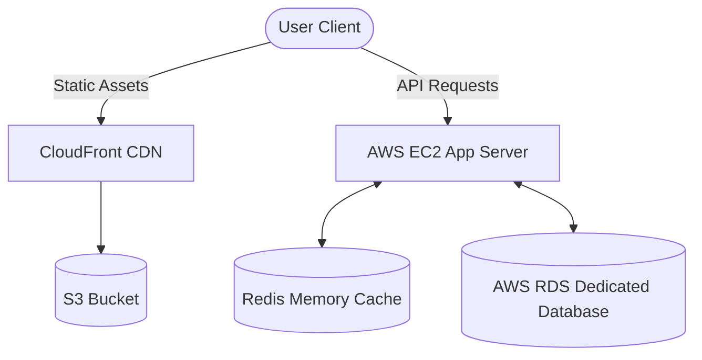
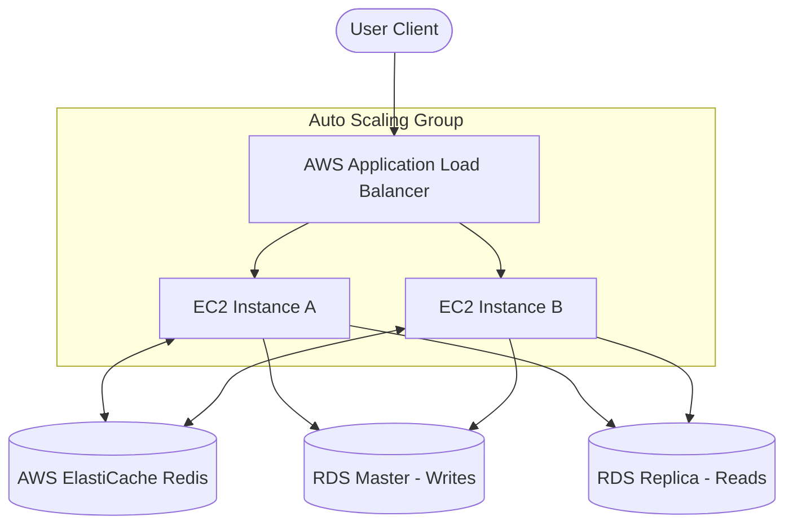
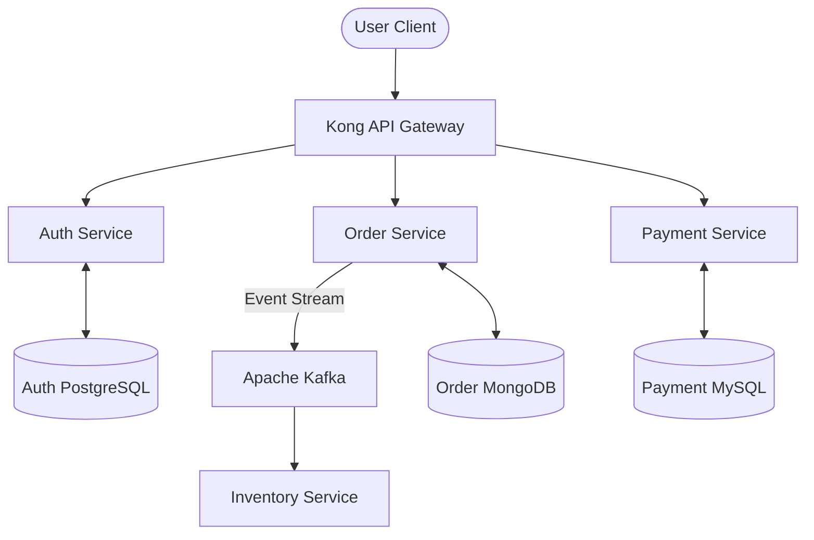
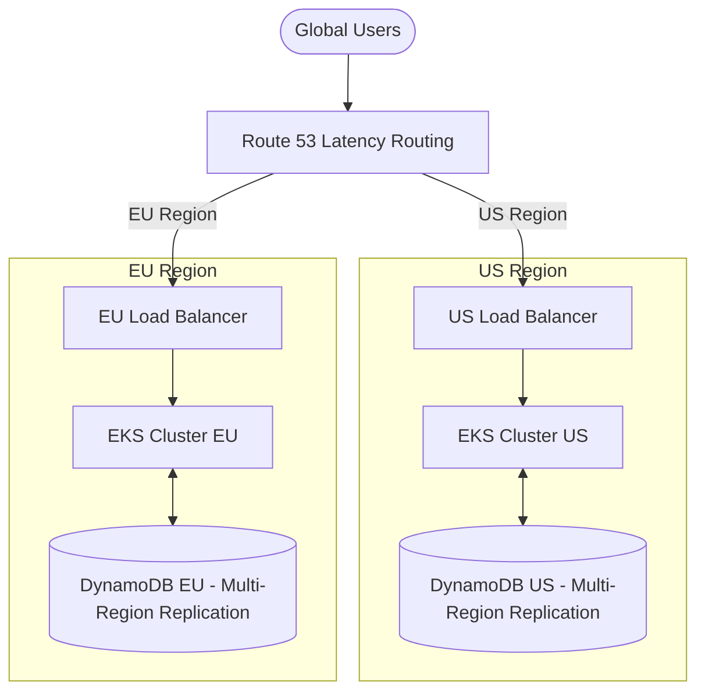

# Monolith to Microservices: Scaling from 1 to 10M+ Users 🚀

This guide outlines the step-by-step evolutionary roadmap of a web application as it scales from a single user to over 10 million concurrent users. It covers the **Architecture Shift**, **Database Evolution**, and **Deployment Strategy** at each phase—critical knowledge for senior SDE interviews.

---

## 📈 The Scaling Journey at a Glance

| Phase | User Base | Architecture | Database | Primary Deployment | Key Tech Stack |
|---|---|---|---|---|---|
| **Phase 1** | **1 - 100** | Single Monolith | Single DB (On-server) | Single VM (EC2) | Node.js, React, SQLite/Postgres, PM2 |
| **Phase 2** | **100 - 10k** | Scaled Monolith + S3 | Dedicated DB + Cache | VM + Managed DB | AWS EC2, RDS, Redis, S3, CloudFront |
| **Phase 3** | **10k - 100k** | Horizontal Monolith | Read Replicas + Session Cache | ECS / Elastic Beanstalk | ALB, Auto-scaling Group, Redis Cluster |
| **Phase 4** | **100k - 1M** | Microservices (SOA) | Database-per-Service | Kubernetes (EKS) | Docker, Kubernetes, Kong API Gateway, Kafka |
| **Phase 5** | **1M - 10M+** | Global Multi-Region | Sharded DB / NoSQL | GitOps & Canary | Terraform, ArgoCD, Route53, DynamoDB, Cassandra |

---

## 📂 Phase-by-Phase Deep Dive

### Phase 1: 1 to 100 Users (The Birth of the Monolith)
* **Objective**: Speed to market, minimum viable product (MVP), low cost.

#### 🏗️ Architecture
* **All-in-One**: Frontend (React) static files, Backend API (Node.js), and Database (PostgreSQL) all reside on a single small virtual machine (e.g., AWS EC2 `t3.micro`).

#### 🗄️ Database
* Relational DB (PostgreSQL) running locally on the same VM using local disk storage.

#### 🚀 Deployment Steps
1. Push code to GitHub.
2. SSH into the EC2 instance.
3. Pull the code, run `npm run build` for React, and start the Node.js server using **PM2** (`pm2 start server.js`) to keep the process alive.

---

### Phase 2: 100 to 10,000 Users (Decoupling & Caching)
* **Objective**: Prevent CPU/Memory exhaustion and improve speed by offloading static assets.

#### 🏗️ Architecture
* **Split DB**: Move the database to a separate dedicated server so that database queries do not compete with the application API for CPU/RAM.
* **Static Assets Offloading**: Build React files and host them on an object store like **AWS S3** fronted by a Content Delivery Network (**AWS CloudFront**).
* **Caching**: Introduce a local **Redis** instance to cache database queries and hot endpoints.

#### 🗄️ Database
* Migrated to **AWS RDS (Relational Database Service)**. This provides automated backups, OS patching, and easy storage expansion.

#### 🚀 Deployment Steps
1. **Dockerization**: Create a `Dockerfile` for the Node.js backend.
2. **CI/CD Pipeline**: Setup a **GitHub Actions** workflow:
   - On commit, build the Docker image and push it to **AWS ECR (Elastic Container Registry)**.
   - Deploy the new container to the EC2 server, replacing the old running container.
   - Upload frontend assets to AWS S3.

---

### Phase 3: 10,000 to 100,000 Users (Horizontal Scaling)
* **Objective**: Remove single points of failure (High Availability) and handle read-heavy traffic.

#### 🏗️ Architecture
* **Horizontal Scaling**: Create multiple copies of the Node.js backend running on separate EC2 servers across different Availability Zones (AZs).
* **Load Balancer**: Put an **AWS Application Load Balancer (ALB)** in front of the instances to distribute user requests evenly.
* **Auto-Scaling**: Configure an **Auto Scaling Group (ASG)** to automatically add/remove instances based on CPU utilization.
* **Shared Session**: Move user session data out of individual server memory into a central **AWS ElastiCache Redis** cluster.

#### 🗄️ Database
* Set up **RDS Read Replicas**. The application writes exclusively to the Master RDS instance and routes all read queries to replica instances, offloading 80% of DB workload.

#### 🚀 Deployment Steps
* **AWS ECS (Elastic Container Service)**:
  - Transition from single EC2 servers to **AWS ECS with Fargate** (serverless containers).
  - Implement a **Blue-Green** or **Rolling Update** deployment strategy using ECS. Traffic is shifted to new containers only after health checks pass, resulting in **zero downtime**.

---

### Phase 4: 100,000 to 1,000,000 Users (The Microservices Transition)
* **Objective**: Scale team velocity and independent system components. Avoid single database bottlenecks.

#### 🏗️ Architecture
* **Deconstruct the Monolith**: Split the monolith into specialized, isolated **Microservices** (e.g., Auth Service, Payment Service, Notification Service) using Domain-Driven Design (DDD).
* **API Gateway**: Use a gateway like **Kong** or **AWS API Gateway** to route traffic, handle authentication, and rate-limiting.
* **Asynchronous Communication**: Introduce **Apache Kafka** or **RabbitMQ** to send messages between services asynchronously (e.g., Order placed -> notify inventory via queue).
* **Database-per-Service**: Each microservice manages its own database. No direct cross-database queries allowed; services communicate only via API or event bus.

#### 🗄️ Database
* Polyglot Persistence: Use the best database for the job. PostgreSQL for Auth, MongoDB for Catalogs/Orders, and Neo4j for social graphs.

#### 🚀 Deployment Steps
* **Kubernetes (EKS)**:
  - Dockerize all microservices.
  - Deploy and orchestrate using **Kubernetes (AWS EKS)**.
  - Use **Helm** to package Kubernetes manifests and **ArgoCD (GitOps)** for continuous deployment. Developers push to git, and ArgoCD automatically syncs and applies updates to the EKS cluster.

---

### Phase 5: 1,000,000 to 10,000,000+ Users (Global Scaling)
* **Objective**: Lower latency for global users, handle extreme database write loads, and guarantee disaster recovery.

#### 🏗️ Architecture
* **Multi-Region active-active**: Deploy complete copies of the application across multiple geographic regions (e.g., US-East, EU-Central, AP-South).
* **Global Load Balancing**: Use Route 53 with **Latency-based / Geo-location routing** to direct users to the nearest healthy datacenter.
* **Edge Computing**: Use Cloudflare Workers or Lambda@Edge to execute lightweight authentication or redirection at the CDN edge.

#### 🗄️ Database
* **Database Sharding**: Partition databases horizontally by user_id or region.
* **NoSQL / Distributed DBs**: Migrate high-throughput relational tables to distributed NoSQL databases like **Amazon DynamoDB** or **Apache Cassandra** for predictable single-digit millisecond latency at petabyte scale.

#### 🚀 Deployment Steps
* **Infrastructure as Code (IaC)**: Define all cloud infrastructure (EKS, DBs, VPCs) using **Terraform**.
* **Canary Deployments**:
  - Deploy updates using **Argo Rollouts**.
  - Direct 5% of global traffic to the new version (Canary).
  - Automatically roll back if Prometheus alarms detect elevated error rates or latency anomalies.
  - If successful, gradually scale up to 100%.
