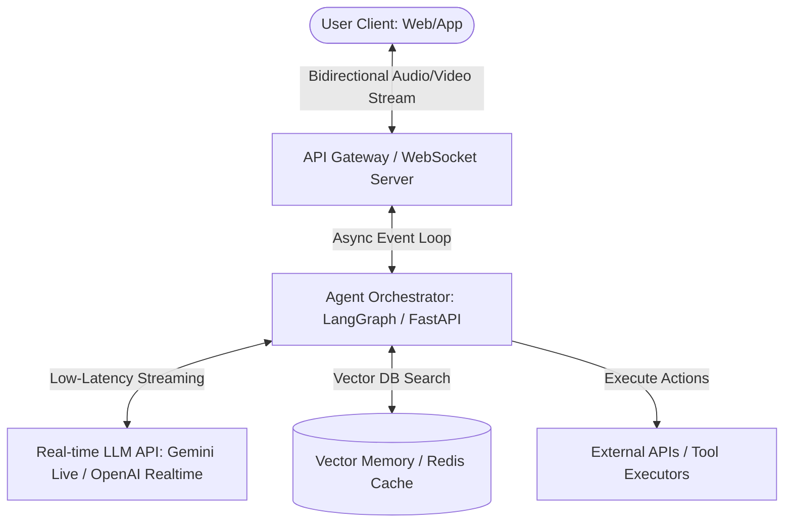

# Real-Time AI Agents: Concepts, Architecture, and 15+ Project Ideas 🚀

Real-time AI Agents are system software or LLM-driven entities that process streams of data (voice, video, text, or financial ticks) and respond with extremely low latency (<500ms). Unlike traditional request-response chatbots (which wait for complete user input, process it, and reply), real-time agents work with **continuous bidirectional streaming** (like phone calls or live video feeds).

---

## 1. Real-Time Agents Key Architecture Patterns 🏗️

Real-time AI agents are built differently than classic REST-API based chat applications. Here is the technology landscape:



### Key Technical Pillars:
* **Protocols**: WebSockets (for structured data/text/audio chunks) and WebRTC (for sub-100ms ultra-low latency audio/video streaming).
* **APIs**: OpenAI Realtime API (WebSockets), Gemini Multimodal Live API (WebRTC/WebSockets).
* **Asynchronous Execution**: Python's `asyncio` is mandatory to handle concurrent streaming and tool execution without blocking the event loop.

---

## 2. 15+ Real-Time AI Agent Ideas (Category Wise) 💡

Here is a mega list of real-time agents you can build to stand out in interviews and expand your portfolio:

### Category A: Voice & Conversational (Low Latency Audio)
1. **AI Language Speaking Tutor (Real-time Feedback)**
   * **Idea**: A voice agent that teaches languages (e.g., Spanish or English) in real-time. It doesn't just converse; it intercepts your audio stream, detects pronunciation errors, and corrects you mid-sentence with gentle voice interruptions.
   * **Tech**: OpenAI Realtime API + Whisper for pronunciation analysis + WhisperDoc.

2. **Real-time AI Interviewer (Grill Master)**
   * **Idea**: An agent that conducts behavioral or technical interviews. It listens to the candidate's answers, senses pauses/hesitations (using latency tracking), and asks dynamic follow-up questions in real-time.
   * **Tech**: FastAPI + WebSockets + LangGraph (state machine for different interview rounds).

3. **Virtual Customer Support Voice Desk**
   * **Idea**: An automated agent that handles inbound phone calls, checks orders in real-time database, and can perform refunds or changes while keeping the user engaged in a natural conversation.
   * **Tech**: Twilio Media Streams + WebSockets + Langchain + FastAPI.

---

### Category B: Workspace & Productivity (Real-time Collaboration)
4. **Real-time Meeting Copilot & Action Item Taker**
   * **Idea**: An agent that sits in an active Google Meet or Zoom call, transcribes audio streams in real-time, identifies conflicts or agreements, and live-updates a Notion document with tasks and action items.
   * **Tech**: Deepgram Live Transcription + Langchain Server + Notion API.

5. **Live Screen Pair-Programming Companion**
   * **Idea**: An agent that watches your active IDE screen (as a stream of screenshots/video) and listens to your spoken thoughts, stepping in vocally when you make a syntax error, logical flaw, or need architectural advice.
   * **Tech**: Gemini 1.5 Pro (Multimodal Video Stream input) + WebSockets.

6. **Interactive Whiteboard Sketch Agent**
   * **Idea**: As you sketch a UI mockup or database schema on a digital canvas, this agent analyzes the drawing in real-time and starts writing the corresponding React frontend or SQL schema code live.
   * **Tech**: HTML5 Canvas + WebSocket + GPT-4o vision streaming.

---

### Category C: Finance, Ops & Real-Time Monitoring
7. **High-Frequency News Sentiment & Crypto Trading Agent**
   * **Idea**: An agent that ingests real-time RSS feeds, Twitter streams, and financial news, converts them to sentiment vectors, matches them with active chart movements, and executes demo trades automatically.
   * **Tech**: Kafka / RabbitMQ (for streaming) + FastAPI + Alpaca API for trading.

8. **Live Log Monitoring & Self-Healing DevOps Agent**
   * **Idea**: An agent connected to Kubernetes or server log streams (like Prometheus/Grafana alerts). It detects anomalies in real-time, runs diagnostics using internal tools, and deploys minor hotfixes (like restarting services or clearing caches) after notifying the team via Slack.
   * **Tech**: Python Asyncio + LangGraph (Human-in-the-loop validation) + Kubernetes SDK.

---

### Category D: Gaming & Interactive Entertainment
9. **Real-time Dungeons & Dragons Dungeon Master (Voice)**
   * **Idea**: A fully voiced DM that describes the fantasy environment, reacts immediately when the player speaks their moves, rolls virtual dice, and plays background music dynamically matching the mood.
   * **Tech**: ElevenLabs Conversational API + LangGraph (for game state and inventory management).

10. **Interactive Storyteller for Kids**
    * **Idea**: An agent that narrates a story and asks the child what they want to do next. It dynamically generates real-time story progressions and streams matching illustrations on the screen using rapid image generation models.
    * **Tech**: SDXL Lightning / Flux (for <1s image generation) + Text-to-Speech.

---

### Category E: Healthcare & Special Assistance
11. **Real-time Medical Scribe**
    * **Idea**: An agent that listens to a doctor-patient conversation in the room, filters out irrelevant casual talk, extracts medical jargon, matches symptoms with ICD-10 medical codes in real-time, and populates the EHR (Electronic Health Record) form.
    * **Tech**: Whisper Live + Med-PALM / Specialized Bio-LLM + FastAPI.

12. **Blind/Low-Vision Real-time Surroundings Narrator**
    * **Idea**: Runs on smart glasses or smartphone camera stream. It describes the surrounding objects, signs, and people walking by in real-time via audio feedback, prioritizing safety hazards.
    * **Tech**: WebRTC video stream + YOLOv8 + Gemini Multimodal Live API.

---

## 3. Real-Time Voice Agent: Boilerplate Code Structure 💻

Here is an asymmetric, production-grade template using **FastAPI** and **WebSockets** that simulates how a real-time agent receives client audio/text chunks, processes them asynchronously, and returns stream responses.

Create a file `realtime_agent.py` and run it:

```python
import asyncio
import json
from fastapi import FastAPI, WebSocket, WebSocketDisconnect

app = FastAPI(title="Real-Time AI Agent Gateway")

class RealTimeAgentOrchestrator:
    def __init__(self):
        self.state = "idle"

    async def stream_response_from_llm(self, user_message: str):
        """
        Simulates streaming responses from a Real-time LLM.
        Replace this with actual Gemini Live API or OpenAI Realtime WebSocket connection.
        """
        words = f"Received your message: '{user_message}'. Let me process this in real-time... Done!".split()
        for word in words:
            await asyncio.sleep(0.15)  # Simulate 150ms network streaming latency
            yield f"{word} "

agent = RealTimeAgentOrchestrator()

@app.websocket("/ws/agent")
async def websocket_endpoint(websocket: WebSocket):
    await websocket.accept()
    print("Client connected via WebSocket.")
    
    try:
        while True:
            # 1. Receive data chunk from client
            data = await websocket.receive_text()
            payload = json.loads(data)
            user_input = payload.get("text", "")
            
            print(f"User Sent: {user_input}")
            
            # 2. Process and Stream back words in real time
            await websocket.send_text(json.dumps({"status": "thinking"}))
            
            async for chunk in agent.stream_response_from_llm(user_input):
                await websocket.send_text(json.dumps({
                    "status": "streaming",
                    "chunk": chunk
                }))
                
            await websocket.send_text(json.dumps({"status": "completed"}))
            
    except WebSocketDisconnect:
        print("Client disconnected.")
    except Exception as e:
        print(f"Error occurred: {str(e)}")
        await websocket.close()

if __name__ == "__main__":
    import uvicorn
    uvicorn.run(app, host="0.0.0.0", port=8000)
```

---

## 4. How to Get Started with Learning Real-Time Agents? 🛠️

1. **Step 1**: Learn Python's `asyncio` inside out. Real-time requires handling tasks concurrently (e.g., listening for user voice interruptions while the agent is speaking).
2. **Step 2**: Study the differences between **WebSockets** (high-frequency JSON/text packets) and **WebRTC** (direct peer-to-peer media streams).
3. **Step 3**: Sign up for **OpenAI Realtime API** or **Gemini Multimodal Live API** (via WebSockets/Google AI Studio) and execute their official starter samples.
4. **Step 4**: Integrate state management. A real-time agent needs to remember what was said 5 seconds ago; use memory systems like Redis or LangGraph state memory.
